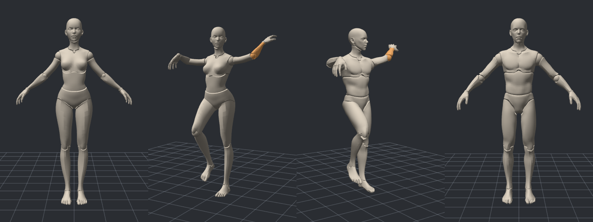
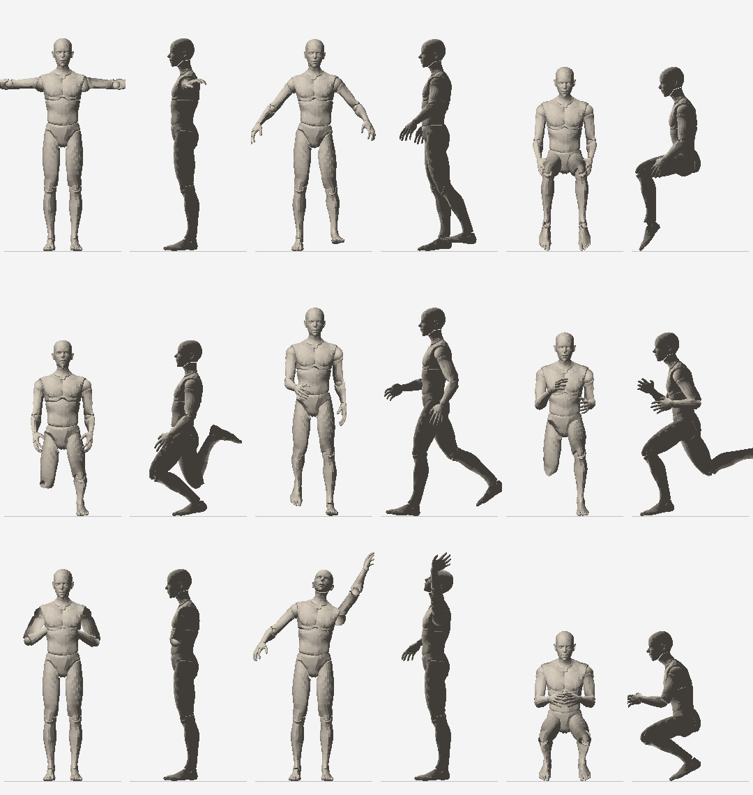
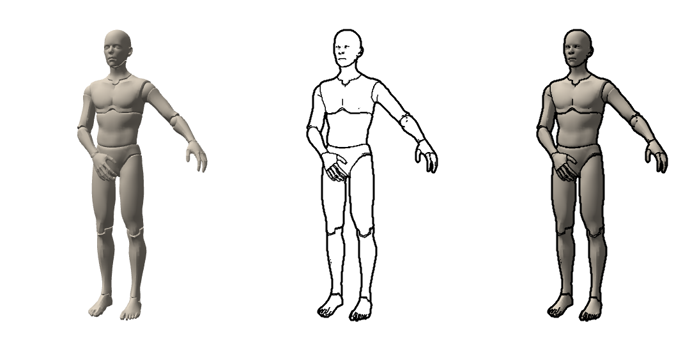

# KSP — Krita Scene Poser

KSP is an embedded posing studio for Krita. This is an early development build, version `0.0.8`. Pose Body-chan or Body-kun in the docker, or right on the canvas with **Pose on Canvas** (CSP-style). Drag body parts or rotate joints with rings, start from a bundled pose, and save your own. Joints stop where a body's would, and fifteen sliders reshape the body itself. Then add the figure to your document as a transparent **line art** layer or a shaded guide layer, at the size and opacity you choose. You can also bring in your own rigged figures from `.glb`, `.vrm` and `.blend` files.

The plugin runs with Krita's bundled Python, PyQt5, and the Python standard library. It does not install packages, contact a server, or run Blender or other external tools. A separate Python installation is only useful for development tests and packaging.

**Compatibility is not yet certified.** Automated checks outside Krita cannot establish that a bundled PyQt build exposes the required GL operations, that a GPU driver works, or that Krita's canvas displays exported pixels correctly. Treat this as an early build, not a supported release.

## Install and enable

1. Build the ZIP below, or use the supplied `dist/ksp-0.0.8.zip`. Earlier builds stay in `dist/` for comparison; install only one at a time.
2. In Krita choose **Tools → Scripts → Import Python Plugin…** and select the ZIP. Restart Krita.
3. Open **Settings → Configure Krita → Python Plugin Manager**, enable **KSP — Krita Scene Poser**, and restart Krita again.
4. Open **Settings → Dockers → KSP — Krita Scene Poser**.

For a manual install, use **Settings → Manage Resources → Open Resource Folder**. Copy the ZIP's `krita_scene_poser.desktop` file and `krita_scene_poser` directory directly into that resource folder's `pykrita` directory, then enable the plugin and restart. The archive must not be nested inside another enclosing directory. These steps follow [Krita's plugin installation guide](https://docs.krita.org/en/user_manual/python_scripting/install_custom_python_plugin.html).

## Pose a figure



Choose **Body-chan** or **Body-kun** at the top of the docker; switching keeps the pose. Click a body part to select it; the hint line says what dragging it does.

**Drag mode** (default):
- Drag a limb to swing it toward the cursor.
- Drag a hand or foot to place it; the arm or leg follows (IK), and the hand or foot keeps its angle.
- **Shift**+drag twists a part around its bone. **Ctrl**+drag rotates a hand or foot itself.
- Drag the hips to move the whole figure. **Shift**+drag the hips to turn it.

**Rings mode** (the **Rings** button or **T**): click a part, then drag one of its rings. The red and blue rings bend the joint; the green ring twists it along the bone.

**View:**
- Right-drag or **Alt**+drag orbits. Middle-drag or **Alt+Shift**+drag pans. The mouse wheel zooms.
- **F** frames the figure. **O** switches between perspective and orthographic.

**Joint limits** are on by default, so elbows and knees cannot bend backwards and every other joint keeps to a plausible range. The hint line says when a joint is against a stop. Turn **Joint limits** off in the Pose tab for exaggerated poses. Dragging a hand or foot may now stop short of the cursor, because a real arm or leg would.

**Edits:**
- **Esc** cancels a drag in progress.
- **Ctrl+Z** and **Ctrl+Shift+Z** undo and redo pose changes while the viewport has focus. This history is separate from Krita's document undo.
- **R** resets the selected joint. The buttons also reset the whole pose, mirror it left to right, or copy the selected limb to the other side.

The docker's tabs hold the rest: **Pose** (canvas switches and edit buttons), **Line Art** (see below), and **Output**. **Output → Create Guide Layer** renders the shaded, posed figure from the current view into a new transparent **KSP Figure Guide** paint layer at the document's size. The vertical framing matches the viewport; the width follows the document's shape.

## Pose on the canvas

- **Show on Canvas** draws the figure on the canvas exactly where the Create buttons would put it. It follows Krita's zoom, rotation, mirroring, and panning, and your brushes keep working.
- **Pose on Canvas** (also the **Tools → Scripts → KSP: Pose on Canvas** action, which you can give a shortcut) works like CSP's Object tool:
  - Drag the figure on the canvas with the same Drag and Rings modes as the docker.
  - Drag empty space to orbit the 3D camera. **Shift**+drag pans the camera; **Ctrl**+drag moves it closer or farther.
  - The mouse wheel, middle-drag, Space, and the right-click palette still control Krita's canvas.
  - Brushes are paused until you turn Pose on Canvas off. The figure stays visible for drawing over.

The docker viewport and the canvas show the same pose; a change in one updates the other. Canvas posing relies on Krita's internal canvas widget, which is not part of Krita's documented plugin API. If a Krita update changes it, canvas posing turns itself off and explains why, and the docker keeps working. **Copy Diagnostics** includes a `[canvas]` section for reporting problems.

## Body shape

The **Shape** tab reshapes the figure with fifteen sliders, each a percentage of the figure's own size.

**Proportions:** height, head size, neck length, torso length, arm length, leg length, hand size, foot size, and shoulder width. Use head size and height together for the classic head-count proportions — a 7-head or an 8-head figure.

**Build:** chest, waist, hips, arm thickness, leg thickness, and an overall build slider that thickens everything at once.

- The numbers update as you drag; the body rebuilds about a quarter of a second after you stop.
- Your pose, camera and history all survive a shape change.
- The figure always stays standing on the ground, whatever you do to its legs.
- **Reset Shape** puts every slider back to 100 %.
- A scene file remembers the body it was made on.

Shape is a property of the figure, not a pose change, so it is not in the pose undo history.

## Poses, presets, and scenes



The **Scene** tab holds nine bundled poses — T-pose, relaxed stance, sitting, kneeling, walking, running, hands clasped, reaching up and crouching. Choose one and press **Apply Pose**; it is a single undo step.

- **Save Pose…** and **Load Pose…** store just the pose. Poses are keyed by joint name, so one saved on Body-chan applies to Body-kun, and later to your own figures.
- **Save Scene…** and **Load Scene…** also keep the camera, the view mode, the line-art settings, both opacities, and the output size.
- KSP remembers your last pose and settings and restores them when the docker opens again. This is stored with Krita's settings, not in your document.
- The same actions are under **Tools → Scripts** as **KSP: Save Pose…** and **KSP: Load Pose…**.

## Line art



The **View** switch above the docker viewport chooses **Shaded**, **Lines**, or **Both**. The same view is shown on the canvas.

The **Line Art** tab sets:
- which lines to draw:
  - **Outline:** the silhouette;
  - **Contours:** where one part passes in front of another;
  - **Creases:** sharp folds;
  - **Seams:** the mannequin's segment lines;
- **Outline width** and **Inner width**, in document pixels;
- **Crease angle**: lower finds more creases;
- **Contour sensitivity**: higher finds smaller overlaps;
- **Color**.

Changing a setting in the Shaded view switches to Both so you can see the effect. The settings are remembered between sessions.

**Output → Create Lineart Layer** renders the lines into a transparent **KSP Lineart** paint layer. Lines are antialiased, and nothing else is on the layer. To see the exact line weight the layer will get, use **Show on Canvas**: the canvas preview is scaled to the document, while the docker viewport shows widths in screen pixels. Every export adds a new layer and never replaces an existing one.

## Output: size, quality, opacity, and updating a layer

The **Output** tab decides what the Create buttons produce:

- **Size** is the document's size by default. **Custom size** renders the figure at any size up to 4096 px and places it **Centered** or at the **Top left**; pixels outside the canvas stay in the layer, as Krita allows.
- **Quality** renders 2× or 4× larger and scales down, for smoother edges and hairlines. Line widths keep their meaning in document pixels. A render past KSP's limit is refused with a message rather than failing halfway.
- **Layer opacity** is applied to the layer KSP creates. You can still change it afterwards in Krita's Layers docker.
- **Update the layer I made last** rewrites the KSP layer from your previous render in this document instead of adding another one, so the buttons read *Update Guide Layer* and *Update Lineart Layer*. If that layer is gone, or you renamed it, KSP leaves it alone and creates a new one.

**Figure opacity** in the Pose tab fades the figure itself, in the viewport, on the canvas, and in the guide layer — useful for drawing over a ghosted figure.

## Your own models

**Scene → Import Figure…** adds your own rigged figure from a `.glb`, `.vrm` or `.blend` file. It joins the figure list beside Body-chan and Body-kun and stays there.

- Bone names from **Rigify**, **Mixamo**, **VRM/VRoid** and Blender's metarig are recognized automatically. A VRM file's own humanoid table is used when it has one. Anything else needs a small `<model>.ksp-map.json` file beside the model.
- KSP turns the figure upright and forward, stands it on the ground, and keeps the size it was authored at unless that size is implausible — then it scales to 1.75 m and says so.
- A partial rig works: what is mapped can be posed, and what is missing simply isn't there. Only the hips are required.
- `.blend` files must be saved with **Compress** off, because Krita's Python cannot unpack Blender's compression.
- Imported figures are converted once and stored in Krita's application-data folder; your original file is never modified.

[docs/custom-figures.md](docs/custom-figures.md) covers preparing a model, the bone name tables, and what each error means.

## Documents and diagnostics

Use a disposable test document in **RGB/Alpha, 8-bit integer/channel, sRGB**. The prototype only exports to `RGBA` / `U8` documents with one of these sRGB profiles:
- `sRGB-elle-V2-srgbtrc.icc`, Krita's new-document default;
- `sRGB-elle-V4-srgbtrc.icc`;
- `sRGB built-in`, which Krita assigns to images opened or pasted without an embedded profile.

Other color models and profiles, including linear sRGB, are rejected with a hint to use **Image → Convert Image Color Space**. KSP never converts them itself.

Each export creates a fresh paint layer, and your existing artwork is never the target. New documents have a white background layer; hide it to inspect the guide's transparency. **Self-Test** renders the Phase 0 color triangle offscreen and checks channel order, orientation, and transparency without touching the document.

Press **Copy Diagnostics** to copy the local versions, GPU, and self-test results when reporting a failure. The report contains no file paths or document names, and nothing is sent automatically. The docker lifecycle (resize, hide/show, float/dock, close/reopen, restart) is not verified yet.

KSP works with Krita's default Windows renderer (ANGLE/Direct3D) and with desktop OpenGL; no Krita setting needs changing. On hybrid-GPU laptops, the diagnostics `renderer` line shows which GPU is active. If the docker reports a missing OpenGL capability, keep that diagnostic and stop testing that build. Do not add PyOpenGL, NumPy, or a helper executable to work around it. If the plugin does not appear, confirm it is enabled, restart Krita, and check the importer placed both archive entries in `pykrita`.

## Menu actions and shortcuts

KSP adds seven actions under **Tools → Scripts**:

- **KSP: Show Scene Poser** opens and raises the KSP docker.
- **KSP: Create Guide Layer** opens the docker and creates a shaded guide layer, like the docker button. A shortcut assigned to its old name, **KSP: Create Layer**, keeps working.
- **KSP: Create Lineart Layer** opens the docker and creates a line-art layer.
- **KSP: Save Pose…** and **KSP: Load Pose…** store or restore a pose file.
- **KSP: Pose on Canvas** switches canvas posing on or off.
- **KSP: Diagnostic Log** turns the diagnostic log on or off.

The actions ship without default shortcuts, so they never clash with Krita's own. To assign keys, open **Settings → Configure Krita → Keyboard Shortcuts** and search for "KSP". If no document is open, the Create buttons are disabled and their tooltips say why.

## Diagnostic log

The log is off by default. When **KSP: Diagnostic Log** is checked, KSP appends one JSON line per event to `krita_scene_poser/logs/ksp.log` in Krita's resource folder (**Settings → Manage Resources → Open Resource Folder**). Events include viewport initialization, context release, and export start, finish, or failure. The log is capped at 512 KB plus two rotated files.

The log records GPU strings, sizes, and timings. It never records file paths, document names, pixel data, or tracebacks. Nothing is sent anywhere, and the setting is saved with Krita's other settings. Diagnostics show whether the log is on.

## Develop and package

From the repository root with Python 3.10 or newer (on Windows, `py -3` avoids other applications' bundled interpreters on `PATH`):

```console
python -m unittest discover -s tests -v
python tools/package_plugin.py
```

The packager writes `dist/ksp-<version>.zip`, taking the version from `krita_scene_poser/__init__.py`. It never overwrites a build: rebuilding identical inputs reports "Already built", and different contents under an existing name fail with a request to bump the version. Text files are stored with LF line endings, so a build is reproducible from a git checkout on any platform. The source history is kept in a local git repository, with one tag per release (`v0.0.4`, `v0.0.5`, …).

These commands require no third-party packages. Tests cover:
- the posing core: vectors, quaternions, matrices, projections, forward kinematics, skinning, two-bone IK, and mirroring;
- the viewport logic: the orbit camera, surface picking (checked against a brute-force test of every triangle), rotation rings, every drag gesture, cancel, and undo/redo;
- the figure shaders' dialects and bone packing (checked against CPU skinning), plus the figure assets and file formats;
- line art: settings validation and storage, line-width scaling, depth ranges and packing, and shader sanity (reserved words, matching varyings, uniform budget);
- joint limits: swing-twist clamping, hinge direction derived from each rig's rest pose, elbows and knees folding the right way on both figures, and a mirrored pose staying legal;
- body shape: clamping and storage, which control reaches which joint, a longer arm measuring longer, a wider waist widening only the waist, the figure staying grounded, unit normals, and identity skinning at rest;
- figure import: bone mapping for four naming schemes and custom maps, weight quantization, the glTF reader against files built by the tests, both `.blend` container layouts against the real source file, facing and scale detection, and 120 fuzzed files that must all come back as plain import errors;
- pose and scene files: round trips, portability between figures, rejection of damaged files, and the bundled presets;
- output sizes, anchors, quality limits, layer opacity, and rewriting a KSP layer without touching anyone else's;
- pixel transfer and the premultiplied readback contract;
- the ctypes GL binding, using native callbacks;
- document integration with test doubles;
- settings, the diagnostic log, and diagnostics;
- the plan's architecture rules: `core/` and `storage/` never import Krita or Qt, and only `integration/` edits documents;
- archive boundaries.

They run outside Krita. Actual Krita/OpenGL acceptance is separate. `tools/krita_host_probe.py` runs the renderer and a real paint-layer export inside Krita without the GUI; the compatibility notes explains how to launch it. The packager uses an explicit runtime allowlist, sorted entries, fixed timestamps and permissions, and a bundled copy of `LICENSE`. Rebuilding unchanged inputs with the same Python/zlib toolchain produces the same ZIP bytes. Development files, tests, caches, and logs do not ship.

The renderer and export assumptions are recorded in the design notes. GL functions are resolved through `ctypes` so ANGLE works; see the design notes. Rendering and layer export are verified in the Krita 5.3.3 GUI on Windows. The docker lifecycle checks are the one open Phase 0 item. Both figures, Body-chan and Body-kun, are compiled into versioned rig and mesh files by a pure-Python `.blend` reader (see the design notes and `docs/images/figures-preview.png`). Viewport rendering, picking, and posing are described in the design notes, canvas posing in the design notes, line art in the design notes, the planned figure importer in the design notes, joint limits, pose files, opacity and output control in the design notes, body shape in the design notes, and figure import in the design notes. Next: separate line and tone layers, and hand and camera presets. The overall roadmap is in the plan.

## Update, disable, or uninstall

To disable KSP, uncheck it in Python Plugin Manager and restart Krita. To update this prototype, close Krita, replace its two entries in `pykrita` with the new version, and restart. To uninstall, disable it, close Krita, and remove only `krita_scene_poser.desktop` and the `krita_scene_poser` directory from `pykrita`. Generated paint layers remain part of their documents.

## License

KSP source and original bundled assets are licensed under **GPL-3.0-or-later**. See [LICENSE](LICENSE). The bundled Body-chan and Body-kun figures are derived from vinchau's CC0 "BodyChan - BodyKun" drawing figures. Provenance and the derived files are listed in [docs/asset-licenses.md](docs/asset-licenses.md). No proprietary assets are bundled.
